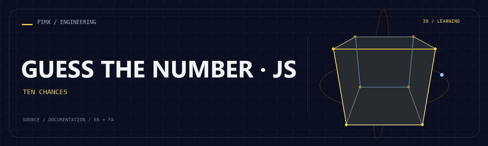

<div align="center">



**[English](README.md) · [فارسی](README.fa.md)**

</div>

# 🎯 GUESS THE NUMBER · JS

A small browser game with a random answer in the range 0–999, higher/lower hints and ten incorrect-guess opportunities.

[GitHub](https://github.com/MOHAMMADREZAABEDINPOOR/gussing-number-with-js) · [PIMX / Profile](https://github.com/MOHAMMADREZAABEDINPOOR) · [Static artwork](assets/readme/hero.png)

| At a glance | Details |
|:---|:---|
| 🎯 Experience | Learning exercise / source archive |
| 🧰 Built with | `HTML / CSS / JavaScript` |
| 🌐 Documentation | [English](README.md) · [فارسی](README.fa.md) |

[✨ Features](#features) · [🚀 Getting started](#getting-started) · [⚙️ Configuration](#configuration) · [🌍 Deployment](#deployment)

---

<a id="features"></a>

## ✨ Features

| Area | Included capability |
|:---|:---|
| ⚡ Workflow | Browser-only HTML/JavaScript |
| ⚡ Workflow | Remaining-lives display |
| ⚡ Workflow | Color-coded attempt feedback |
| ⚡ Workflow | Reset/reload control |

<a id="stack"></a>

## 🧰 Stack

| Tool | Version / source |
|---|---|
| HTML / CSS / JavaScript | `static files` |

<a id="getting-started"></a>

## 🚀 Getting started

A modern browser; Python is optional for the local HTTP server.

```bash
git clone https://github.com/MOHAMMADREZAABEDINPOOR/gussing-number-with-js.git
cd gussing-number-with-js

python -m http.server 8000
```

<a id="configuration"></a>

## ⚙️ Configuration

No standard environment template is defined. Standalone exercises need no external configuration; inspect any service constants or paths in the source before running.

<a id="usage"></a>

## 🎯 Usage

Open 1.html, enter a number and click Check. Reset reloads the page and selects a new answer.

<a id="project-structure"></a>

## 🗂️ Project structure

| Path | Role |
|---|---|
| [`assets/`](assets/) | Brand/media/README assets |
| [`1.html`](1.html) | Project entry/configuration file |

<a id="commands-and-checks"></a>

## 🧪 Commands and checks

No automated test command is declared in a manifest. Verify behavior through a local example run.

<a id="deployment"></a>

## 🌍 Deployment

This is a local learning exercise, not a public service. Browser exercises can use static hosting.

<a id="limitations"></a>

## 📌 Limitations

The answer is stored client-side and can be inspected. Progress is not persisted.

<a id="troubleshooting"></a>

## 🛠️ Troubleshooting

- Wrong page: open the HTML entry point or the relevant Week directory.
- Missing assets: serve the complete directory and retain relative paths.

<a id="contributing"></a>

## 🤝 Contributing

Create a focused branch, verify the affected behavior and explain the change clearly. Keep private data, build outputs and local databases out of commits.

<a id="license"></a>

## 📄 License

No repository-level license file is included in this snapshot. Public visibility alone does not grant reuse rights; contact the repository owner for terms.

---

Part of **PIMX** · Documentation in English and Persian.

---

<div align="center">

🎯 **GUESS THE NUMBER · JS** · [English](README.md) · [فارسی](README.fa.md)

</div>
